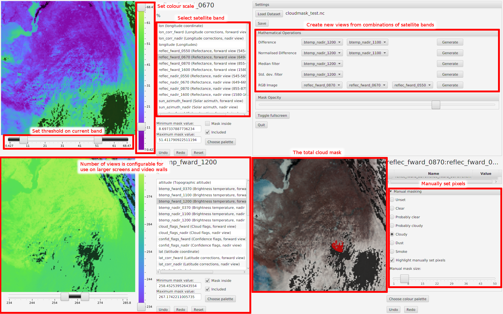

Cloud Masking Tool
==================

This tool was developed to allow researchers to apply various algorithms and manual adjustments to satellite imagery with the aim of creating the most realistic estimate of cloud locations possible.  Developed as a bespoke research tool for a single user, there is no detailed documentation.  However, this README contains a high-level overview of how to use the software.  If you wish to use this software and require any further information, please contact the author.

Features
--------

The tool has the following main features:

* Configurable number of linked views of satellite bands, as well as a combined cloud mask panel showing the overall cloud mask
* Creation of new views from various combinations of satellite bands
* The ability to apply both inclusive and exclusive thresholds to individual views
* Combining thresholds from individual views into a total cloud mask
* Manually setting individual pixels on the final cloud mask

Data Format
-----------

Input data should be a NetCDF file containing 2-dimensional data.  Any number of variables may be present, but they must all share the same 2-dimensional shape.  The tool was originally designed for working with data at 512x512 resolution, and so the screen layout is ideally suited to this, but any size of data can be used.

Output data will be a NetCDF file containing all of the fields in the input data, along with:
* Any of the generated views which contributed to the final cloud mask
* All of the cloud masks from individual views which contributed to the final cloud mask
* The manual cloud mask
* The final composite cloud mask

All of these fields will contain sufficient metadata to see exactly how they were generated, and if an output file is used as input during another session, all of the appropriate settings will be applied. 

Configuration
-------------

To configure the layout, a file named `cloudmask.properties` should be on the Java class path.  It may contain the following entries in the format `key=value`:

* `rows`.  The number of rows of views to display.  The minimum is 2, since 2 rows are used for the display of the view combination and total cloud mask panels
* `columns`. The number of columns of views to display.
* `imageWidth`.  The width, in pixels, to render the views at.  The views will be displayed at this width multiplied by the scale factor (defined below)
* `imageHeight`.  The height, in pixels, to render the views at.  The views will be displayed at this height multiplied by the scale factor (defined below)
* `scale`.  The scale factor to multiply view sizes by.  By using a combination of rendering size and a scale factor, the settings can be adjusted to provide a maximum size whilst still achieving an acceptable rendering speed - with a large number of views all being rendered at a high resolution, the tool can become slow.

Author
------

This software was developed by <guy.griffiths@the-iea.org>